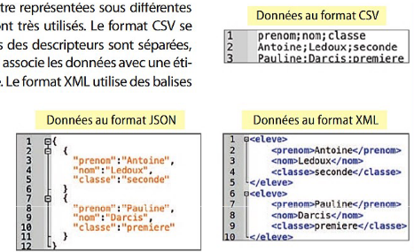

# Manipulation de données avec le langage SQL

------

Cette activité permet de découvrir un nouvel outil manipulant des données. Il s'agit du langage SQL.

# 1. Présentation :

Le langage SQL : Langage informatique utilisé pour exploiter les bases de données. Il est possible de rechercher des données, d'en ajouter, de les modifier et les supprimer. Sa première version date de 1974. Et est majoritairement utilisé à partir des années 80.

Base de données :  Voici une (très petite) base de données. Cette base de données contient une table nommée Eleve

| Prénom | Numéro étudiant | Classe | Matière préférée |
| :-- | :-: | --- | --- |
| Bob | 01 | 2G78 | SNT |
| Louise | 02 | 2G78 | Anglais |
| Alice | 03 | 2G00 | SNT |
| Tim | 04 | 2G00 | SNT |
| Julien | 05 | 2G13 | Musique |
| Clement | 06 | 2G93 | Musique |
| Hector | 07 | 2G13 | Anglais |

A partir de cette table nous pouvons introduire plusieurs notions :

- La première ligne contient les **descripteurs** il s'agit des noms de colonnes.
- Une **valeur** est un élément contenu dans une colonne
    - Bob est une valeur de Prénom
- Un objet ou **une donnée** est une ligne de la table

*Il faut imaginer en réalité qu'une table de donnée peut contenir des dizaines de milliers de lignes. Et ce pour une seule table. Des tables peuvent être manipulées ensemble, grâce aux jointures par exemple et ceci peut augmenter considérablement le nombre de lignes.*

Fichier de base de données :

Ici nous manipulons des fichiers .sql, mais il existe d'autres types de fichier.

- Les fichiers .odt, .xls (Tableur)
- Les fichiers .csv (Tableur)
- Les fichiers .json
- Les fichiers .xml

<u>Requête SQL :</u>

Pour manipuler la base, il faut écrire une requête. Celles-ci sont assez semblables à ce que l'on pourrait dire en langage naturel. 

Par exemple :

- Sélectionner toutes les données de la table *Eleve*
    - Select * from *Eleve*
- Sélectionner la colonne classe de la table *Eleve*
    - Select Classe from *Eleve*

Pour sélectionner plusieurs colonnes il faut écrire colonne1, colonne2, .... , colonne n

Afin de sélectionner toutes les colonnes nous utilisons *****

# 2. Travail à faire :

Le but de ce travail est d'écrire les requêtes correspondantes en fonction des énoncés. Les énoncés en français sont à réécrire en SQL (ou inversement)

Pour travailler il faut aller sur ce site : [https://fxjollois.github.io/cours-sql/](https://fxjollois.github.io/cours-sql/)

Puis : 

- Cliquez sur "Requêtage direct"
- Cliquez sur "bibliotheque"
    - Cela permettra de sélectionner la base de données bibliothèque ainsi que toutes ses tables.
    - Pour voir les différentes tables il est possible de cliquer sur "Schéma" ou "tables" cela affichera les tables avec les noms de colonnes.

Pour exécuter une requête il faut écrire dans la partie réservée à droite. Puis cliquer sur "Exécution"

## 2. 1. Requêtes de base :

1) Ecrire la requête suivante : select * from Livre

Que renvoie cette requête ? Quel est son équivalent en français?

2) Ecrire en SQL les requêtes suivante : 

- a) Sélectionner les titres dans la table Livre
- b) Sélectionner les titres et les type dans la table Livre
- c) Sélectionner toutes les colonnes de la table Lecteur

3) Exprimer en français les requêtes SQL suivantes : 

- select titre, nbPages from Livre
- select nomAuteur from auteur

## 2. 2. Requêtes utilisant "where" :

Jusqu'à présent nous avons sélectionné toutes les lignes de chaque table, par contre nous n'affichions pas forcément toutes les colonnes des tables.

Maintenant nous allons voir comment sélectionner certaines lignes de la table.

Par exemple dans la table livre si nous voulons les livres ayant plus de 400 pages nous allons écrire.

- select * from Livre where nbPages > 400
    - Ce qui correspond à "Selectionne toutes les colonnes de la table livre ou la valeur de la colonne nbPages est supérieur à 400

1) Ecrire en SQL les requêtes suivantes : 

- Dans la base de donnée world :
    - Sélectionner toutes les colonnes des pays ayant une surfaceArea supérieur à 100000 dans la table Country
    - Sélectionner les colonnes name, continent de la table Country si l'année d'indépendance (IndepYear) est supérieur à 1910
    - Sélectionner les noms de tous les pays d'Europe dans la table Country