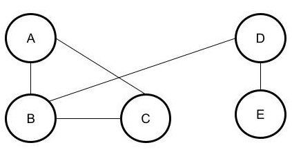

# Petit monde / graphe 

------

## 1. Notion de petit monde :

La notion de petit met en avant le fait qu'il y a un certain nombre de personnes intermédiaires entre deux inconnus.

Point historique :

A l'origine le terme de petit monde est apparu en **1929**, Milgram fit son expérience en 1967 en demandant à 60 personnes de passer une lettre de main en main jusqu'à un destinataire final, celui-ci est inconnu des premières personnes. Une moyenne de 6 degrés a été relevée, il fallait donc envoyer la lettre à 5 personnes avant d'arriver au destinataire final.

Dans les années 2010, une étude similaire portait sur le même phénomène mais utilisait les messageries instantanées (Microsoft, Facebook, Twitter) et la distance entre deux personnes inconnues à été baissée à **4 degrés** en moyenne. *Certaines études parlent d'un degré de séparation de **3 degrés**.*

## 2. Graphes : comment modéliser les relations entre les individus ?

Il existe une structure permettant de modéliser les relations entre utilisateurs, il s'agit des **graphes**

<u>Voici un graphe :</u> 

Ce graphe se décrit comme suit : 

- A est ami avec B et C
- B est ami avec A,C, D
- C est ami avec A,B,
- D est ami avec B et E
- E est ami avec D

Il existe différentes définitions sur les graphes :

- **Sommet : Il s'agit d'un élément du graphe**
    - *Dans notre exemple, il peut s'agir de A,B,C,D,E*
- **Distance :** Nombre d'arrêtes minimales entre deux sommets
- **Centre :** Le centre d'un graphe est le (ou les) sommet(s) étant le plus proche de tous les autres sommets du graphe.
    - *Dans notre exemple, les centres sont B et D*
- **Rayon :** Le rayon d'un graphe est la distance maximale de son centre avec les autres sommets du graphe.
    - *Exemple : Dans le graphe ci-dessus, les centres sont B et D.*
        - *Distance de B,A = 1; Distance de B,C = 1; Distance de B,D = 1; Distance B,E = 2*
        - Distance de D,A = 2; Distance de D,B, = 1; Distance de D,C = 2; Distance D,E =2
            - La plus grande distance des centres par rapport aux autres sommets est de 2 donc **le rayon du graphe vaut 2.**
    
- **Diamètre :** Le diamètre d'un graphe est la distance entre les deux sommets les plus éloignés.
    - *Exemple : Ici le diamètre du graphe est de 3, il s'agit de la distance C,E ou A,E.*

