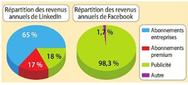

# Réseaux sociaux : Synthèse

------

## 1. Introduction

De manière générale un réseau est un ensemble de *nœuds et/ou composants* **reliés ensemble par des *liens.*** Celui-ci permet donc **une distribution de *flux*** (électricité, eau, gaz, etc..), **ou de *données discrètes*** (Informations, courriers, etc.)

**Un réseau social est donc un ensemble de personnes relié par des amitiés (abonnement), permettant une distribution de données (Like/Commentaire/Message).**

Certains réseaux ont des usages dit "professionnel" comme LinkedIn, d'autres sont crées pour le divertissement. Chaque réseau à ses caractéristiques, Instagram se spécialise dans la photo, Tiktok dans un flux "infini" de vidéos ou encore Facebook qui reste généraliste.

Ces applications sont en perpétuelle concurrence, ce qui les force à toujours proposer de nouvelles fonctionnalités ou copier celles déjà existantes. (Réels et Stories d'Instagram par exemple) Le contenu partagé entre les utilisateurs se diversifie lui aussi. Aujourd'hui des photos, vidéos, fichiers (de toute sorte) sont partagés sur la quasi-totalité des réseaux. Là ou en 1970 seulement des messages et de léger fichier étaient partageables.

*<u>Remarque :</u> C'est différences se réduisent aujourd'hui, chaque réseaux permet de partager tous types de fichier, les différences se font sur les **usages**.*

## 2. Données et identification

Afin de pouvoir partager et utiliser pleinement un réseau il est nécessaire de créer un compte. L'identification permet grâce à un login (identifiant) de reconnaitre un utilisateur du réseau.

- Sur Twitter, Snapchat, Instagram ... cela fonctionne avec un "@" ex : @elevedesnt
  - Cet identifiant est unique

Grâce à ce compte, des données sont créées, lorsque l'utilisateur partage avec ses amis/abonnés ou interagi avec d'autres utilisateurs. Ces données sont stockées dans les bases de données de l'entreprise, certaines d'entre elles peuvent être accessible par un certain nombre de personnes.

Tout ce qui est accessible sur un compte permet de créer une réputation. Cette réputation représente ce que
les autres pensent de vous. En ligne celle-ci est appelée e-reputation. 

## 3. Modèle économique des réseaux sociaux 

Chaque plateforme possède son propre modèle économique. Mais on retrouve globalement deux moyens de financement :

- Des publicités
- Un contenu payant offrant des fonctionnalités supplémentaire.

<u>Voici deux modèles économique :</u> 

## 4. Cyberviolence

Le partage de données n'est pas toujours bénéfique et peut nuire à la réputation d'autrui. L'essor des réseaux sociaux n'a pas que des aspects positifs, le cyberharcèlement est un des points les plus négatifs des réseaux sociaux.

Les intimidations, des insultes, de la diffusion d'information ou de photo personnelle sont des formes de violence.

**Harcèlement** : Violence répétée qui peut être verbale, physique ou psychologique.
**Violence** : Utilisation de la force ou le pouvoir pour blesser (endommager) autrui (ou un objet / une idée)
**Cyberviolence** : Violence en ligne (avec outils numériques) 
**Cyberharcèlement** : Harcèlement en ligne (avec outils numériques)
**3018 :** Numéro d'aide en cas de cyberharcèlement

