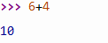
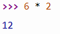
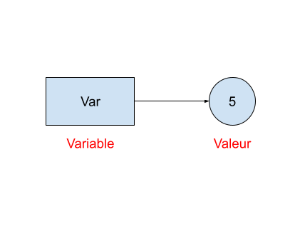

# Découverte de python

------

## 1. Utilisation de la console 

### 1. 1. Ecrire et/ou compléter ces calculs dans la console python

<u>Exemples :</u> 

- 6 + 4 => ... 
  - Donnera 10 dans la console python
    - 

- 6 * ... =>  12 
  - Ici il faut trouver quoi écrire à la place des '...' pour que la console affiche 12
  - Il faut ici écrire 2
    - 

## Exercice 1 :

<u>Partie 1 :</u>

- 5 + 62=> ...
- 7/2 => ... 
- 6-5 => ... 
- 78//67 => ...
- 78/67 => ...
- 5%4 => ...

<u>Partie 2 :</u>

- 6 +  ... => 7
- 7 - ... => 4
- 7 - ... => 14
- 6//... => 2
- 15 % ... => 1
- 3/ ... => 1.5

Si des opérateurs (ici +,-,//,*,/,%) posent problème n'hésitez pas à faire une recherche web pour connaître leur utilité.

## 2. Utilisation de la partie édition de programme

### 2. 1. Définitions :

**Variable :** Une variable est utilisée pour stocker une valeur 

**Affectation :** Une affectation permet de donner une valeur à une variable



Ici j'affecte à la variable *Var* la valeur 5

En python, c'est l'opérateur '=' qui permet de faire une affectation :

```python
# Affecter une valeur en python : 
var = 5

# Lorsque j'exécute mon programme 
# Dans la console :
>>> var
5
```

### 2. 2. Exercices d'application :

<u>Partie 1 :</u>

1. Stocker la valeur 10 dans une variable appelée `a` et la valeur 20 dans une variable appelée `b`. 
   - Dans la console faire la somme de `a` et `b` en utilisant l'opérateur `+`.

2. Stocker la valeur 67 dans une variable appelée `c` et la valeur -78 dans une variable appelée `d`. 
   - Dans la console faire la somme de `c` et `d` en utilisant l'opérateur `-`.

3. Stocker la valeur 'Je suis une phrase' dans une variable appelée `e` et la valeur 8 dans une variable appelée `f`. 
   - Dans la console faire la somme de `e` et `f` en utilisant l'opérateur `*`.

4. Stocker la valeur 14 dans une variable appelée `g` et la valeur 6 dans une variable appelée `h`. 
   - Dans la console faire la somme de `g` et `h` en utilisant l'opérateur `%`.

5. Stocker la valeur 34 dans une variable appelée `i` et la valeur 3 dans une variable appelée `j`. 
   - Dans la console faire la somme de `i` et `j` en utilisant l'opérateur `/`.
6. Stocker la valeur 34 dans une variable appelée `k` et la valeur 3dans une variable appelée `l`. 
   - Dans la console faire la somme de `k` et `l` en utilisant l'opérateur `//`.

<u>Partie 2 :</u>

Donner une explication des opérateurs suivants (à l'aide d'une recherche web et/ou en essayant d'autres exemples) :

- %, /, //

## 3. Exercice :

Dans un nouveau fichier :

1. Créez une variable appelée `a` et affectez-lui la valeur 10.
2. Créez une variable appelée `b` et affectez-lui la valeur 6.
3. Créez une variable appelée `c` et affectez-lui la valeur 78.
4. Créez une variable appelée `result` et affectez-lui la valeur de la somme de `a`, `b` et `c`.
5. Affichez la valeur de `result`. (La fonction associée est dans un des documents du cours / Ou faire une recherche web)
6. Exécutez votre fichier afin d'observer le résultat attendu.
