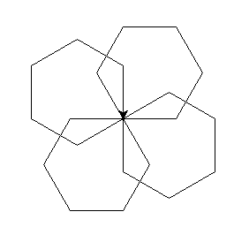

# Construction élémentaire 5 : Utilisation du module turtle

------

## Objectifs :

- Importer un module 
- Manipuler des fonctions
- Ecrire des documentations

## Présentation :

Turtle est une bibliothèque permettant de manipuler un "crayon" afin de tracer des figures géométriques

Afin de l'utiliser il faut rajouter cette ligne (au début du fichier de préférence) dans l'éditeur de programme :

- import turtle
  

Ici nous avons importé la bibliothèque _turtle_, cela implique que toutes les fonctions écrites dans un fichier "turtle.py" sont utilisables.

Afin d'utiliser les fonctions de la bibliothèque il faut précéder celles-ci de "turtle."

Par exemple : turtle.left(90)  Nous appelons la fonction _left()_ du module _turtle_


## Exemple de présentation :

Faites un copier coller de ce code, puis exécutez le :

```python
# ne pas oublier d'importer le module
turtle.forward(100)
turtle.left(90)
turtle.forward(100)
turtle.left(90)
turtle.forward(100)
turtle.left(90)
turtle.forward(100)
```
1. Quelle est la figure dessinée ici ?

2. Transformer ce bout de code en une fonction

## Exercice 2 : 

1. Ecrire une fonction triangle_equilateral() qui prend en paramètre une longueur _long_ et qui dessine un triangle équilatéral

## Exercice 3 : 

1. Ecrire une fonction hexagone() qui prend en paramètre une longueur _long_ et qui dessine un hexagone

1. Ecrire une fonction rose() qui va dessiner une rose à l'aide de 4 hexagones


<u>Résultat attendu :</u>




## Exercice 4 : 

1. Dessiner un drapeau tricolore, celui de votre choix. Utilisez les fonction **fillcolor()**, **begin_fill()**, **end_fill()**.

## Exercice 5 : 

1. Dessiner le symbole de la triforce (voir jeu Zelda), chaque triangle devra être de couleurs différentes