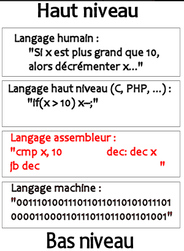

# Langage interprété et compilé :

## 1. Langage interprété

Un langage de programmation interprété est un type de langage de programmation pour lequel les programmes sont exécutés par un interpréteur plutôt que par un compilateur. Cela signifie que, au lieu de compiler le code source en code machine exécutable avant de l'exécuter, l'interpréteur lit et exécute le code source directement.

Il y a de nombreux avantages à utiliser un langage interprété plutôt qu'un langage compilé :

- Le développement est plus rapide, car il n'est pas nécessaire de compiler le code avant de l'exécuter.
- Il est plus facile de déboguer le code, car l'interpréteur affiche les erreurs au fur et à mesure qu'elles se produisent.
- Les programmes interprétés sont généralement plus portables, car ils peuvent être exécutés sur n'importe quelle plateforme disposant d'un interpréteur pour le langage en question.

Cependant, il y a également des inconvénients à utiliser un langage interprété :

- Les programmes interprétés sont généralement moins efficaces en termes de performance que les programmes compilés, car ils doivent être interprétés chaque fois qu'ils sont exécutés.
- Les programmes interprétés peuvent être plus difficiles à protéger, car le code source est accessible et peut être facilement modifié.

## 2. Langage compilé :

Un langage de programmation compilé est un type de langage de programmation pour lequel les programmes sont convertis en code machine exécutable par un compilateur avant d'être exécutés. Cela signifie que, avant de pouvoir exécuter un programme écrit dans un langage compilé, il est nécessaire de le compiler en code machine qui peut être exécuté par l'ordinateur.

Il y a de nombreux avantages à utiliser un langage compilé plutôt qu'un langage interprété :

- Les programmes compilés sont généralement plus efficaces en termes de performance que les programmes interprétés, car ils sont convertis en code machine qui peut être exécuté directement par l'ordinateur.
- Les programmes compilés sont généralement plus faciles à protéger, car le code source n'est pas accessible et ne peut pas être facilement modifié.

Cependant, il y a également des inconvénients à utiliser un langage compilé :

- Le développement est généralement plus lent, car il est nécessaire de compiler le code avant de pouvoir l'exécuter.
- Il peut être plus difficile de déboguer le code, car les erreurs ne sont généralement pas affichées avant la compilation.
- Les programmes compilés ne sont généralement pas aussi portables que les programmes interprétés, car ils nécessitent un compilateur spécifique pour chaque plateforme sur laquelle ils doivent être exécutés.

 ## 3. Niveau des langages :

Il existe différents types de niveau pour les langages de programmation. 

**Python se trouverait dans les langages de hauts niveaux**

