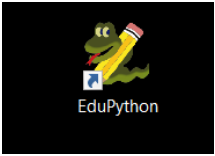
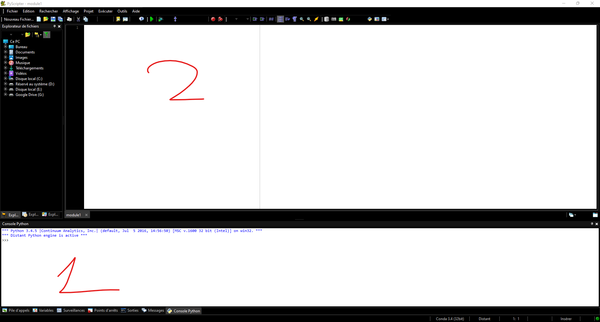
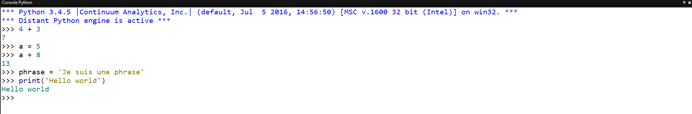
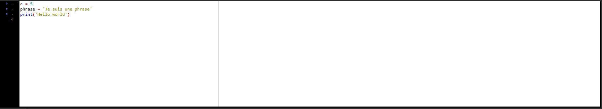
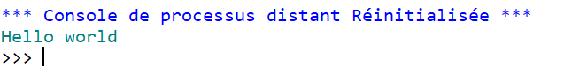
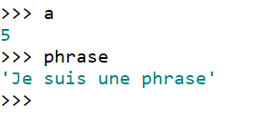
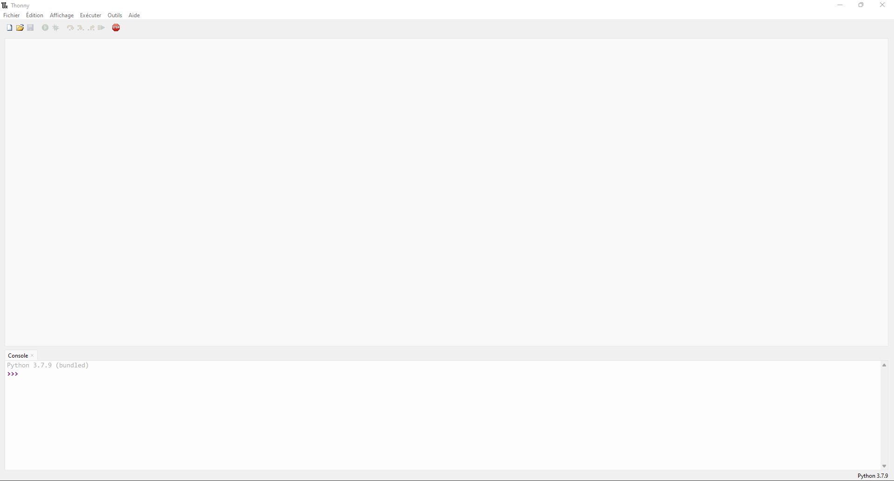

# Utilisation d'un IDE (Edupython/Thonny)

## 1. Présentation de l'interface Edupython :

Edupython est un logiciel permettant de coder en python. 

Voici son icone : 

=> Une fois ouvert voici l'interface :

On distingue deux parties distinctes :

La partie 1 appelée console est la partie ou le programme sera exécuté, on peut aussi y écrire du code python.

La partie 2 est la partie où l'on va écrire le programme.

## 2. Partie 1 console python:

La partie 1 permet donc d'écrire des lignes de code directement dans la console

<u>Par exemple :</u>

Dans la console je peux donc :

- Faire des calculs
- Affecter des valeur à des variables 
  - **a = 5** est une **affectation**
  - **phrase ='Je suis une phrase**' en est une aussi)
- Appeler des fonctions 
  - print('Hello world') => m'affiche la phrase 'Hello world' dans la console.
    - *print est une fonction*

## 3. Partie 2 Edition de programme 

Le problème avec la console python est qu'une fois le logiciel fermé, rien n'est enregistré. 

La partie 2 appelée édition de programme, permet d'écrire du code et de l'enregistrer dans un fichier.

<u>Par exemple :</u>

Je peux donc ici enregistrer le code et créer un fichier contenant ces instructions (instruction => ligne de code)

Maintenant je peux **exécuter** ce code, grâce à l'icone =>

Voici ce que j'obtient dans la **console python** :

Ici ce qu'il s'est passé :

- Le programme a **enregistré** la **variable** *a* ayant pour **valeur** 5
- Le programme a **enregistré** la **variable** *phrase* ayant pour **valeur** 'Je suis une phrase'
- Le programme a exécuté la fonction *print( )* et a donc afficher **Hello world** dans la console.

Je peux maintenant dans la console appeler *a* et *phrase* par exemple :

Comme j'ai enregistré ces données dans mon fichier elles sont sauvegardées et donc je n'ai pas besoin de les réecrire.

**Mais pour cela je dois bien cliquer sur ma petite icône 'exécuter'**

## 4. Thonny :

Thonny est un IDE plus léger et est donc plus rapide à lancer. Il possède une interface moins chargée. Il permet de faire exactement la même chose qu'Edupython. 

