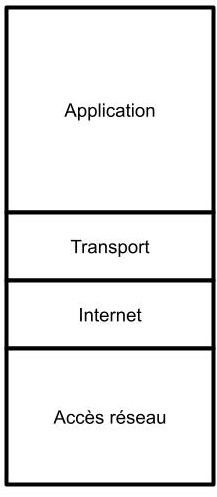
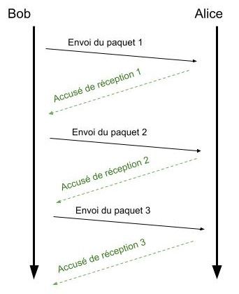

# Réseau internet :

------

Un réseau est un ensemble de *nœuds et/ou composants* **reliés ensemble par des *liens.*** Celui-ci permet donc **une distribution de *flux*** (électricité, eau, gaz, etc..), **ou de *données discrètes*** (Informations, courriers, etc ..)

**En informatique** un réseau est composé d'équipements informatiques tel que des ordinateurs, des routeurs etc... Les liens en informatique sont divers eux aussi (sans fil, Ethernet, fibre optique). La distribution est basée elle sur l'échange de données, d'informations.

## 1. Quels sont les types de réseaux ?

### En informatique il existe différents types de réseaux :

<u>Les réseaux PAN :</u> 

Le réseau PAN (Personal Area Network) est un réseau restreint ayant une portée de quelques mètres. Il fonctionne grâce au protocole Bluetooth (ondes radio).

- Un téléphone relié à des écouteurs sans fil est un réseau PAN

<u>Les réseaux LAN :</u>

Le réseau LAN (Local Area Network) est un réseau à l'échelle d'une maison ou d'une entreprise. il est plus communément appelé réseau intranet.

- Des comptes élèves d'un lycée sont stockés dans le serveur du lycée, seules les machines connectées au réseau du lycée peuvent y accéder.

<u>Les réseaux MAN :</u>

Le réseau MAN (Metropolitan Area Network) est un réseau à l'échelle d'une ville. Il relie plusieurs réseaux LAN.

- Un campus universitaire est considéré comme un réseau MAN par exemple.

<u>Les réseaux WAN :</u>

Le réseau WAN (Wide Area Network) est un réseau à l'échelle d'un pays, utilisé par les grandes entreprises et les opérateurs. (Internet est un réseau WAN)

## 2. Historique :

Au départ on ne parlait pas "d'Internet", par contre le projet de réunir quelques universités américaines était dans l'esprit des chercheurs. Le but, utiliser un réseau afin de transmettre des informations, ce projet débuta dans les années 1960. Tout devait être mis en place, les protocoles de communications, la connectivité des machines entre elle, etc.

C'est en **1967** que le précurseur d'internet vu le jour **ARPANET**

​																	*(Source : Wikipédia)*

On voit avec cette carte les connexions possible au US, ici seuls quelques villes pouvaient communiquer entre elles. 

C'est en **1973** que le protocole **TCP/IP** fut défini. Le protocole utilisé jusqu'à présent pour le réseau ARPANET était obsolète dès sa création, utilisant des IMP (ancêtre du routeur) et ne gérant pas les erreurs d'envoi et de réception des données.

Les années passent et c'est en **1983** que le protocole TCP/IP et le mot **Internet** furent adoptés.
Très vite le nombre de machine connectées entre elle augmenta :

- 1 000 en 1984
- 10 000 en 1987
- 100 000 en 1989
- 1 000 000 en 1992
- 4 600 000 000 en 2021

## 3. Protocole et modèle TCP IP

### 1. Modèle TCP/IP :

 

**Ce modèle permet de donner une représentation d'une machine dans le réseau.** Il est représenté par des couches, dans ces couches se trouvent les protocoles possiblement utilisés.

#### <u>Couche accès réseau :</u>

Cette couche permet de comprendre comment la machine est reliée au réseau :
Par exemple, on peut admettre qu'une machine est relié par **WIFI** sur un **routeur**

#### <u>Couche Internet :</u>

La couche internet utilise le protocole **IP (internet protocol)** (Que l'on expliquera plus bas dans le cours)

#### <u>Couche Transport :</u>

Cette couche contient les protocoles possible pour l'envoi des données, en effet selon le protocole les données peuvent être envoyées de manière différente. Ici se trouve le protocole **TCP**

#### <u>Couche Application :</u>

Grâce au réseau internet il est possible de faire plusieurs choses, jouer en ligne, envoyer des mails, aller sur le **WEB**. Chaque application possède son protocole, **HTTP(S)** pour le **WEB** notamment.

### 2. Protocole TCP :

Le protocole TCP est un protocole permettant l'envoie de message entre deux machines. Il fonctionne par envoie et accusé de réception.

<u>Exemple :</u>

- Bob souhaite envoyé la phrase suivante à Alice : "Bonjour comment vas tu?"
- Le protocole TCP va dans un premier temps découper le message e en **paquets** et les numéroter : 'Bonjour ', 'comment ', 'vas tu ?'
  ('Bonjour ' paquet 1, 'comment ' paquet 2, 'vas tu ?' paquet 3)
- Le protocole envoie les **paquets** un à un et une fois un paquet reçu Alice envoie un **Accusé de réception**
- Une fois tout les paquets envoyés la communication est terminée, **s'il y a des accusés de réception non reçus Bob renvoie les messages perdus**

Voici un exemple d'exécution du protocole.

*On peut aussi imaginer que les paquets ne soient pas reçus dans le même ordre, comme le protocole numérote les paquets alors ils seront remis dans le bon ordre une fois reçu.*

### 3. Protocole IP :

Le protocole IP permet d'associer à chaque machine (téléphone, ordinateur, console, etc.) une **adresse IP**. Celle-ci permet donc d'identifier une machine dans le réseau Internet.

Cette adresse IP(V4) est constitué de 4 nombres compris entre 0 et 255 appelés **Octets** séparés par des points.

Voici une adresse IP : 168.192.9.1

